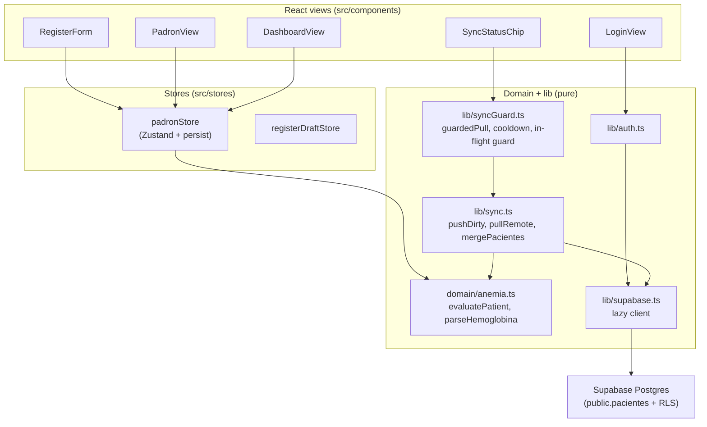
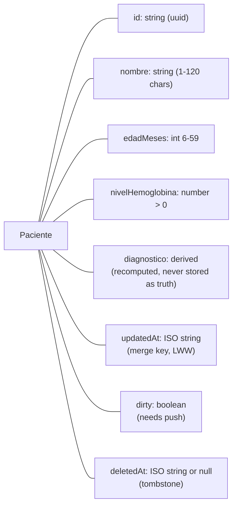

# Architecture: local first, server second

The local padron (Zustand + localStorage) is the source of truth. Supabase is a deferred replica that only changes on an explicit manual sync.

## Quick path

1. User registers a patient → `RegisterForm` validates via `padronStore` → stored locally, marked `dirty`.
2. Staff review in `PadronView`, analyze in `DashboardView`.
3. Staff press **Sincronizar** → push dirty rows, pull remote rows, merge, recompute diagnoses.

## Layers

| Layer | Responsibility | Never does |
|-------|---------------|------------|
| Components | Render Spanish UI, collect input, show sync status | No clinical math, no direct Supabase calls |
| Stores | Own the padron, validate invariants, persist to localStorage | No network |
| Domain (`domain/anemia.ts`) | Pure evaluator + Hb parser, zero I/O | No state, no side effects |
| Lib (`lib/sync.ts`, `syncGuard.ts`) | Push/pull/merge, cooldown + in-flight guard | No auto-sync, no UI |
| Supabase client (`lib/supabase.ts`) | Lazy client, `null` when unconfigured | Never throws when credentials are missing |

## Paciente record

Remote rows mirror this in snake_case (`edad_meses`, `nivel_hemoglobina`, `updated_at`, `deleted_at`) plus `user_id` for RLS ownership — see `toRemoteRow` / `fromRemoteRow` in `src/lib/sync.ts`.

## Key files

| Path | Role |
|------|------|
| `src/App.tsx` | Auth gate + tab routing (Registro / Padrón / Panel) |
| `src/domain/anemia.ts` | `evaluatePatient`, `HB_CUTOFF_LABEL`, `parseHemoglobina` |
| `src/stores/padronStore.ts` | Padron state, validation, `MAX_PADRON = 100` |
| `src/lib/sync.ts` | `pushDirty`, `pullRemote`, `mergePacientes`, `SYNC_PAGE_SIZE = 1000` |
| `src/lib/syncGuard.ts` | In-flight guard, 20 s pull cooldown, shared status vocabulary |
| `src/lib/supabase.ts` | Lazy client, `isSupabaseConfigured` |
| `src/lib/auth.ts` | Email/password seam over `supabase-js` auth |
| `src/hooks/useOnline.ts` | Connectivity signal for sync surfaces |

## Checklist

- [ ] New clinical logic goes in `src/domain/` as a pure function with tests.
- [ ] New server state goes through `lib/sync.ts` — never call Supabase from a component.
- [ ] UI copy stays Spanish; code, comments, and identifiers stay English.

## Next step

Sync and sign-in details: [sync-and-auth.md](sync-and-auth.md).
