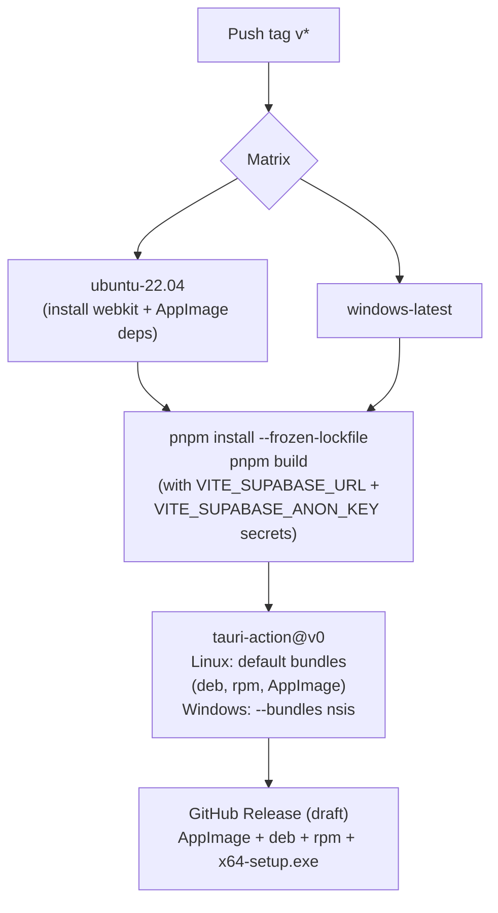

# Desktop releases: tag it, CI builds it

Push a `v*` tag and GitHub Actions builds Linux + Windows installers with Supabase credentials baked in, then attaches them to a (draft) GitHub Release.

## Quick path (release a version)

```bash
# 1. Bump the version in all three files (must match)
#    package.json, src-tauri/tauri.conf.json, src-tauri/Cargo.toml
# 2. Commit, tag, push — CI does the rest
git add package.json src-tauri/tauri.conf.json src-tauri/Cargo.toml
git commit -m "chore(release): v0.2.0"
git tag v0.2.0 && git push origin v0.2.0
```

Then open the GitHub Release (created as **draft**) and press Publish.

- [ ] Version bumped in `package.json`, `src-tauri/tauri.conf.json`, **and** `src-tauri/Cargo.toml`
- [ ] `git tag vX.Y.Z && git push origin vX.Y.Z` pushed
- [ ] CI run green on both matrix jobs
- [ ] Release published (it starts as draft)

## CI pipeline (`.github/workflows/release.yml`)



Current release: **v0.1.0** (AppImage / deb / rpm / `x64-setup.exe`).

## Gotchas

| Gotcha | Detail |
|--------|--------|
| `--target` ≠ bundler | In Tauri 2, `--target` is the Rust triple; bundler selection is `--bundles`. The workflow once had this exact bug (`627792e` fixed NSIS via `--bundles`, not `--target`) |
| Icons are required | The build fails without `src-tauri/icons/`. Regenerate with `pnpm tauri icon <1024x1024.png>` |
| Secrets are build-time | Vite inlines `VITE_SUPABASE_URL` / `VITE_SUPABASE_ANON_KEY` at build; CI reads them from GitHub Secrets during `pnpm build`. Desktop bundles therefore need a rebuild to pick up new credentials |
| Unsigned binaries | Windows shows a SmartScreen warning; Linux AppImage needs `chmod +x` before first run |
| Draft release | `releaseDraft: true` — the Release exists but is invisible until you publish it |

## Install for end users

```bash
# Linux (AppImage)
chmod +x Despistaje-de-Anemia_*.AppImage
./Despistaje-de-Anemia_*.AppImage
```

Windows: download the `.exe` (NSIS installer) from the Release and open it. If SmartScreen warns, choose "More info → Run anyway" (binaries are unsigned).

## Next step

Local development and testing: [development.md](development.md).
