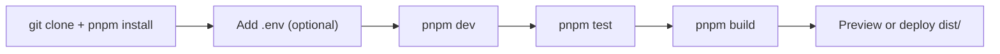

# Development: setup, test, build, deploy

## Quick path (new contributor)



```bash
git clone <repo-url> && cd anemia-despistaje-app
pnpm install
pnpm dev      # web development
pnpm test     # must stay green (436 tests)
pnpm build    # typecheck + bundle
```

Prerequisites: Node 20+, pnpm 10, and (desktop only) the Tauri v2 system deps + Rust stable — CI installs them via `apt-get` on `ubuntu-22.04` (see `.github/workflows/release.yml`); run the same list on a fresh Linux machine.

## Environment

| Variable | Required? | Effect |
|----------|-----------|--------|
| `VITE_SUPABASE_URL` | No | Enables sync + login when present with the key below |
| `VITE_SUPABASE_ANON_KEY` | No | Enables sync + login when present with the URL above |

Vite inlines these **at build time**. No env ⇒ the app runs fully local and sync surfaces show `"La sincronización no está configurada. Faltan las credenciales de Supabase."`. Changing credentials requires a rebuild.

```bash
# Optional local backend wiring
cat > .env <<'EOF'
VITE_SUPABASE_URL=https://pcguplseyisocjgqssvz.supabase.co
VITE_SUPABASE_ANON_KEY=<anon-key>
EOF
pnpm dev
```

> Never commit `.env` or real keys. The project URL above is public-by-design (anon key is rate-limited by RLS); the secret value stays in GitHub Secrets / your local `.env` only.

## Scripts

| Command | What it does |
|---------|--------------|
| `pnpm dev` | Vite dev server (Tauri shell expects port 1420) |
| `pnpm build` | `tsc --noEmit && vite build` → `./dist` |
| `pnpm preview` | Serve `./dist` locally to verify the production bundle |
| `pnpm test` | `vitest run` — full suite once, must pass before every commit |
| `pnpm tauri` | Tauri CLI: `pnpm tauri dev`, `pnpm tauri build`, `pnpm tauri icon <1024x1024.png>` |

## Testing

```bash
pnpm test                          # full suite (21 files, 436 tests)
pnpm test src/domain/anemia.test.ts  # single file while iterating
```

Conventions: colocated `*.test.ts(x)` next to the source, Testing Library + jsdom for components, injected fakes (not network) for Supabase seams — see `src/lib/sync.test.ts` and `src/lib/auth.test.ts`. New domain rules need pure-function tests; new sync behavior needs push/pull/merge tests.

## Web deployment (static SPA)

Any static host works (Dokploy is used in production):

1. Build command: `pnpm install --frozen-lockfile && pnpm build`
2. Publish directory: `./dist`
3. Port: `80`
4. Env vars `VITE_SUPABASE_URL` / `VITE_SUPABASE_ANON_KEY` **must be marked "Available at build time"** — otherwise the bundle ships without them and the app silently runs fully local.

## Conventions

| Area | Rule |
|------|------|
| Language | UI strings Spanish; code, comments, identifiers English |
| Clinical math | Pure functions in `src/domain/`; UI hints import `HB_CUTOFF_LABEL`, never retype cutoffs |
| Server access | Components never touch Supabase — go through `src/lib/sync.ts` / `src/lib/auth.ts` |
| Hb inputs | `type="text"` + `inputMode="decimal"`, parsed with `parseHemoglobina` (never `type="number"`) |
| Commits | Conventional commits, no AI attribution trailers |

## Checklist (before every commit)

- [ ] `pnpm test` green
- [ ] `pnpm build` clean (`tsc --noEmit` included)
- [ ] No credentials committed; no brand/clinical content invented
- [ ] Docs updated if behavior changed

## Next step

Product context and architecture: [architecture.md](architecture.md).
