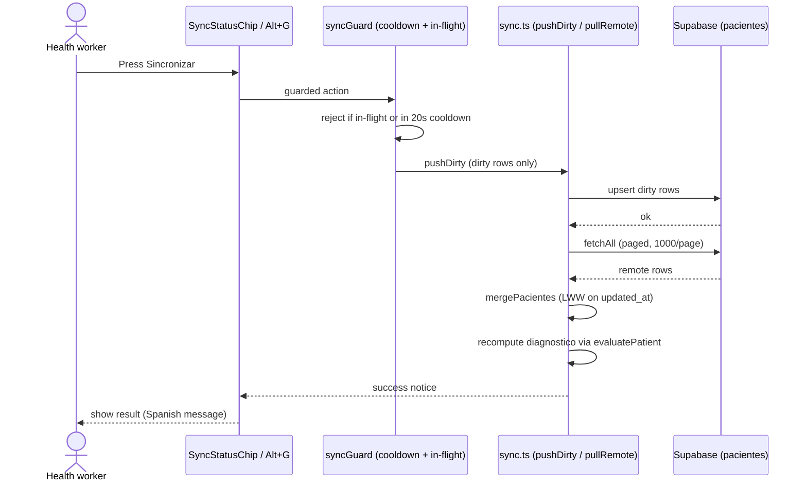
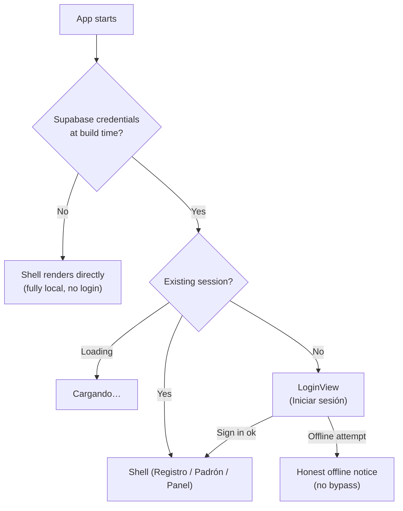

# Sync and auth: manual, offline-first, per-user

Sync is a deliberate button press, not a background process. Local data always wins until staff tap **Sincronizar** (Alt+G).

## Quick path (happy path)

1. Staff tap **Sincronizar** while online with pending changes.
2. App pushes dirty records to Supabase.
3. App pulls all remote rows, merges last-write-wins on `updated_at`, recomputes every `diagnostico` locally.
4. Chip shows the outcome; failures stay visible until the next attempt.

## Merge rules

| Situation | Winner |
|-----------|--------|
| Both sides edited the same row | Newer `updated_at` wins (ISO strings compare chronologically) |
| Remote row carries `deleted_at` newer than local | Row is dropped (tombstone) |
| Row exists only on one side | Kept (remote-only rows append in remote order; remote tombstones are skipped) |
| `diagnostico` disagrees | Always recomputed from `nivelHemoglobina` — remote label is never trusted |
| A local edit lands mid-sync | Version-guarded clean-marking keeps `dirty: true` so it rides the next push (`filterUnchangedIds`) |

Without credentials or network, sync is a clear no-op with an honest message:

| Condition | Message shown |
|-----------|---------------|
| Offline | `"Sin conexión. Los cambios están guardados en este equipo y se sincronizarán más tarde."` |
| Supabase not configured | `"La sincronización no está configurada. Faltan las credenciales de Supabase."` |
| Nothing pending | `"No hay cambios pendientes de sincronización."` |

Status vocabulary is shared (`src/lib/syncGuard.ts`): `"A salvo en este equipo"` (safe locally), `"Sin conexión"` (offline), `"<N> por sincronizar"` (pending count). Cooldown between pulls is 20 s (`DEFAULT_PULL_COOLDOWN_MS`); a second press inside the window gets `"La sincronización está actualizada. Inténtalo de nuevo en unos segundos."`.

## Auth gate

Email/password only. Google OAuth was removed (`cf60497`); `src/lib/auth.ts` exposes sign-in, sign-up, password reset, sign-out, and session subscription.

Rules:

- The gate is `isAuthConfigured()` (`src/lib/supabase.ts`): credentials present ⇒ session required; absent ⇒ app runs fully local.
- Offline, unauthenticated users see an offline notice — there is intentionally no bypass, because records without an owner break the per-user RLS model.
- Password reset redirects to the app origin, which must be allowlisted under Supabase Dashboard → Authentication → Redirect URLs.
- Hb shortcut: after sign-in, Alt+G syncs from any tab; Alt+1/2/3 switch tabs; Alt+S submits the register form.

## Database and RLS

| Item | Fact |
|------|------|
| Table | `public.pacientes`, one row per patient, `user_id uuid` owner column |
| Base migration | `supabase/migrations/20261003000000_create_pacientes.sql` (table + 4 per-user policies) |
| Prod migration | `supabase/migrations/20261005011222_prod_rls_backfill.sql` — guarded, idempotent: adds `user_id`, aborts on non-seed ownerless rows, deletes seed rows, drops `pilot_allow_all`, sets `DEFAULT auth.uid()` + `NOT NULL` + FK + 4 ownership policies + grants. Never drops the table |
| Rollbacks | `supabase/rollback/*.down.sql` — kept out of `migrations/` because the CLI applies `*.sql` alphabetically and a `.down.sql` there would run before the `CREATE` |
| Seed | `supabase/seed.sql` is local-only with a guard that aborts unless `user_id` exists — never run against the hosted project |
| Policies | 4 × `TO authenticated` with `(SELECT auth.uid()) = user_id` (select / insert / update / delete own rows) |
| Pre-step before prod apply | `pg_dump` backup + CSV export of seed rows first |

Client inserts send no `user_id`: Postgres fills `DEFAULT auth.uid()` and the `WITH CHECK` policies reject spoofed ids.

## Checklist

- [ ] I pressed **Sincronizar** (or Alt+G) — nothing uploads by itself.
- [ ] Offline edits are safe: they stay `dirty` and push on the next manual sync.
- [ ] A diagnosis that looks stale recomputes from hemoglobin — check `nivelHemoglobina`, not the label.

## Next step

Desktop builds with embedded credentials: [desktop-releases.md](desktop-releases.md).
